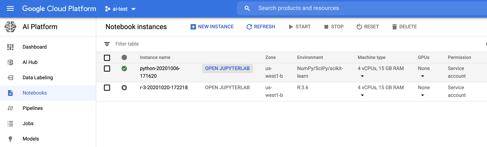
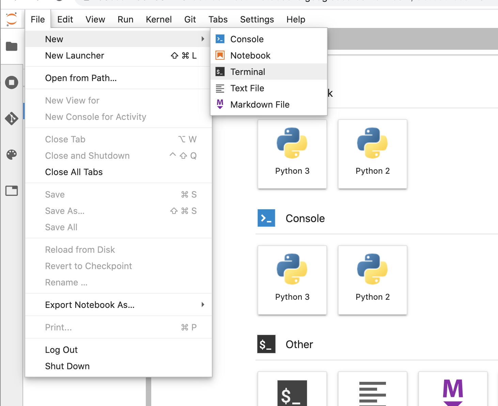
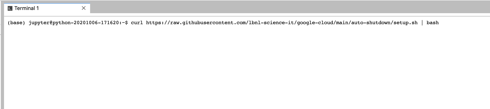

To install:

Connect to Jupyter instance by clicking the "OPEN JUPYTERLAB" link in the "Notebook Instances" dashboard of the Google Cloud console.

Open new "Terminal" from Jupyter menu:

You can install either by downloading and executing the setup script with curl, or you can download the setup file and run it.

**To install via curl:**  
`curl https://raw.githubusercontent.com/lbnl-science-it/google-cloud/main/auto-shutdown/setup.sh | bash`

**To install via download and run:**  
`$ curl -O https://raw.githubusercontent.com/lbnl-science-it/google-cloud/main/auto-shutdown/setup.sh`  
`$ chmod u+x setup.sh`  
`$ ./setup.sh`
